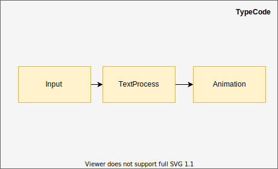

# TypeCode

## O que é?
Aplicação de animação de código sendo digitado.

## Por que?
Para gerar **animação** de códigos para README.md de projetos

## Objetivos Concluídos
- Ler a entrada do usuário
- Gerar animação (apresentar para o usuário)
- Modificar velocidade da animação 
- Repetir animação
- Processar texto

## Metas
- Trocar tema da aplicação ( Light / Dark Mode )
- Salvar preferências do usuário no `localStorage`
  - Tema escolhido
  - Velocidade escolhida
- Implementar detecção de palavras chaves no código
- Grava gif da animação 
- Fazer o download do gif da animação 

## Estratégia
